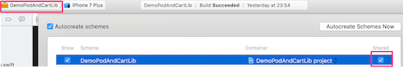
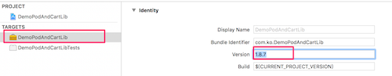
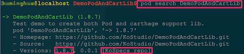

# 制作Pod和Carthage都支持的库

## 目的
 发布共享代码，能同时使用`pod`和`carthage`管理framework
 如下：
 
 + 在`podfile`中添加
 ```ruby
 pod 'DemoPodAndCartLib' 
 ```

 + 或者，在`Cartfile`中添加：
  ```ruby
  git "https://github.com/KoStudio/DemoPodAndCartLib.git"
  ```

---
## 制作手顺
1. Xcode创建Dynamic Framework工程：`DemoPodAndCartLib`，
> 

2. 并设置主framework为`Shared`
>

3. 制作*.podspec文件放在根目录下
  >命令：`pod spec create DemoPodAndCartLib`
  >然后修改相应配置
  >**注意修改版本号要和push到git仓库的tag一致**
  > 
  
4. 在根目录下创建`Classes` 和`Assets`子目录用于放源码文件和资源文件

5.  在根目录下创建Demo工程，用于写示例 (非必须)

6. 上传到git仓库, 打上`tag`
  ```ruby
  ...
  git commit -a -m"add to git"
  git push
  git tag 1.8.7
  git push --tags
  ```
  
    **注意：发布之前要修改版本号：** 
   > +  `CFBundleShortVersionString`: 如：`1.8.7` //对应 `tags`
   > 
   > 
   > +  `CFBundleVersion` 如：255, (_在`taget`的`Build Settings`中搜索：`CURRENT_PROJECT_VERSION`)
   > 


7. 将`DemoPodAndCartLib.podspec`发布到私有库`repo`或公有库`trunk`
  + 验证： 
  > 本地验证:  `pod lib lint` 
  >
  > 远程验证:  `pod spec lint`
  
  + 发布到私有仓库`KoSpec`：
  > 命令： `pod repo push KoSpecs  DemoPodAndCartLib.podspec`
  > 完成后会在目录：`~/.cocoapods/repo/KoSpecs/`下 
  > 生成：`DemoPodAndCartLib/1.8.7/DemoPodAndCartLib.podspec` 
  > 
  > 同时会自动**push到KoSpec**服务器仓库，所在的目录结构也会变成：`KoSpecs/DemoPodAndCartLib/1.8.7/DemoPodLib.podspec`

```
   ├── Specs
       └── [SPEC_NAME]
          └── [VERSION]
 	           └── [SPEC_NAME].podspec
```
	
+  或 发布到`cocoapods`公有仓库：
   >命令：`pod trunk push KoSpecs  DemoPodAndCartLib.podspec`
	  
  ----
  
## 使用手顺

### Carthage中使用

####  下载编译：
 > `git "https://github.com/KoStudio/DemoPodAndCartLib.git" `
 >  运行  `carthage update --platform iOS`

#### 配置
+  在`Target` 中的 
   	   -  _`Embedded Binaries`_ 和
       -  _`Linked Frameworks And Libraries`_中添加编译好的`framework`
		>  

 +  加入以下路径
		在 _Target_ 中的 _Build Setting_ 中的 _Framework Search Path_ 项加入以下路径：
      _`$(SRCROOT)/Carthage/Build/iOS`_
      >(注意：直接通过鼠标右键_"`Add Exsit Files`"_添加到工程中时，会自动添加路径)

  
### Pod中使用
 (_可能需要运行一次`pod repo update KoSpecs`或删除`~/Library/Caches/CocoaPods/`下的`search_index.json`_)

#### 命令行中查询：
  `pod search DemoPodAndCartLib`
 

#### podfile中使用
  在podfile中添加：`pod 'DemoPodAndCartLib' `
 
   运行：`pod install`
  